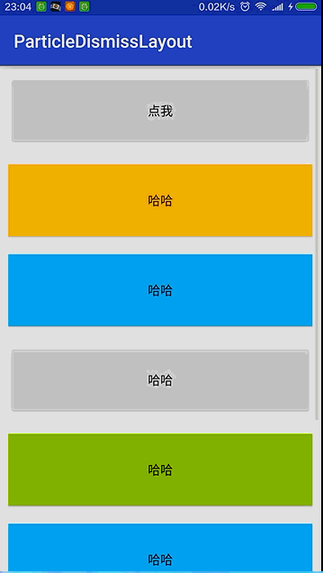

# ParticleDismissLayout
#粒子碎裂效果
>Effect of particle Boom.

>视图碎裂效果。


#Preview
---



---
#Usage 
#java

```
 final ParticleView particleAnimator = new ParticleView(MainActivity.this,3000);//3000为动画持续时间 
        particleAnimator.setOnAnimationListener(new ParticleView.OnAnimationListener() {
            @Override
            public void onAnimationStart(View view,Animator animation) {
                //动画开始
                view.setVisibility(View.INVISIBLE);
            }
            @Override
            public void onAnimationEnd(View view,Animator animation) {
                //动画结束
            }
        });
        findViewById(R.id.btn).setOnClickListener(new View.OnClickListener() {
            @Override
            public void onClick(View v) {
                particleAnimator.boom(v);//开始动画
            }
        });

```
###About me
---
An Android Developer in ZhengZhou.

【[**我的简书地址**](http://www.jianshu.com/users/3c751e06dc32/latest_articles)】

【[**我的CSDN地址**](http://blog.csdn.net/zhangke3016)】

=======


###License
=======
Copyright  2016  zhangke

Licensed under the Apache License, Version 2.0 (the "License");
you may not use this file except in compliance with the License.
You may obtain a copy of the License at 
http://www.apache.org/licenses/LICENSE-2.0
Unless required by applicable law or agreed to in writing, software
distributed under the License is distributed on an "AS IS" BASIS,
WITHOUT WARRANTIES OR CONDITIONS OF ANY KIND, either express or implied.
See the License for the specific language governing permissions and
limitations under the License.
